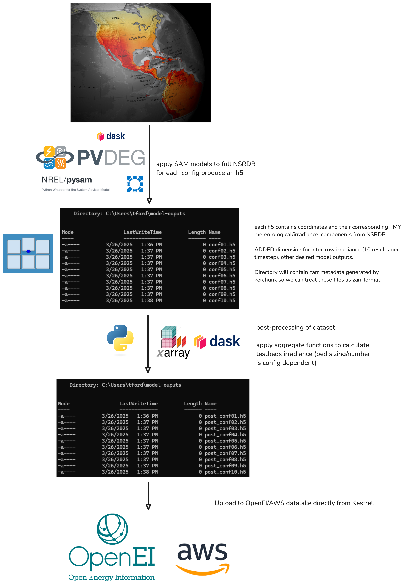

# Agrivoltaics Irradiance Dataset Workflow

This document will describe how we apply the tools created for the production of this dataset to go from original NSRDB TMY data to our final agrivoltaics irradiance dataset result.

